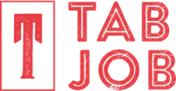

<h4 align="center">
   
  🗃️<b>Bem vindo ao Tab Job!</b>
</h4>

  
  

 

### :gear: Tecnologias usadas
Este projeto foi desenvolvido com as seguintes tecnologias:
- [Node.js](https://nodejs.org/en/)
- [Expo](https://expo.io/)
- [Express](https://expressjs.com/pt-br/)
- [ExpressJs](https://expressjs.com/pt-br/)
- [Nodemon](https://www.npmjs.com/package/nodemon)
- [Axios](https://www.npmjs.com/package/axios)
- [Cors](https://www.npmjs.com/package/cors)
- [Eslint](https://www.npmjs.com/package/eslint)
- [Jest](https://www.npmjs.com/package/jest)

### :muscle: Projeto
Tab Job é um projeto que visa ajudar, de forma a agilizar e controlar o trabalho
de um equipe eliminando formas não seguras de tabulação.